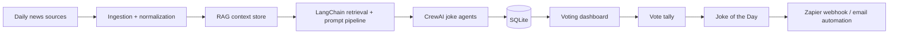

# AI Joke of the Day

This repository exists to turn the learning goals from the discussion into a real product shape:

- RAG for pulling in relevant headline context
- LangChain for the retrieval and prompt pipeline
- CrewAI for multi-agent joke generation and refinement
- Zapier for daily delivery, triggers, and automation
- Pinecone as the vector database for retrieval

The product loop is simple:

1. Pull daily news headlines.
2. Retrieve relevant context with RAG.
3. Generate 10 joke candidates with LangChain + CrewAI.
4. Let users vote on a dashboard.
5. Pick the funniest joke.
6. Email the winner as the Joke of the Day through Zapier.

The implementation is intentionally hybrid:

- TypeScript handles the product shell and deterministic domain helpers
- Python handles the LangChain, CrewAI, and Zapier workflow layer

## Why This Project Exists

The goal is not just to build a joke generator. It is to learn how the individual pieces of an agentic AI system work together in one product:

- a retrieval layer
- a chain/orchestration layer
- a multi-agent layer
- a no-code automation layer
- a human feedback loop

That makes this a better learning project than a one-off chatbot.

## Architecture

## Repo Layout

- `src/` - Core TypeScript domain logic used by the MVP
- `python/jokerag_agent/` - Python workflow layer for RAG, CrewAI, and Zapier
- Pinecone indexes stay inside the free Starter-plan envelope: one project, `us-east-1`, 1M read units, 2M write units, and 2GB storage
- `tests/` - Vitest coverage for the workflow helpers
- `python/tests/` - Standard-library tests for the Python workflow layer
- `Taskfile.yml` - Standard task entry points
- `PROJECT.md` - Project-specific rules
- `SPECIFICATION.md` - Implementation spec

## Current Status

This repo currently contains the foundation for the product, including deterministic core helpers, the Python workflow layer, and the spec.
The next implementation step is to wire the Python service to real APIs and connect the dashboard to the shared data layer.

## Environment

- `NEWS_API_KEY` - news provider API key
- `OPENAI_API_KEY` - model access for RAG, LangChain, and CrewAI calls
- `RESEND_API_KEY` - email delivery
- `PINECONE_API_KEY` - Pinecone Starter-plan access for vector retrieval
- `PINECONE_INDEX_NAME` - Pinecone index name, default `jokerag-headlines`
- `PINECONE_NAMESPACE` - Pinecone namespace, default `daily-headlines`
- `PINECONE_REGION` - Pinecone region, default `us-east-1`
- `DATABASE_URL` - SQLite connection string for the MVP

## Quick Start

1. Install Node.js 20+ and Task.
2. Run `npm install`.
3. Copy `.env.example` to `.env` and fill in secrets.
4. Run `task check`.
