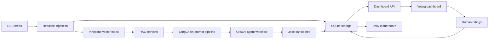

# JokeRAG

JokeRAG is a headline-grounded humor system that turns current news feeds into short joke candidates, stores the source context for retrieval, and gives human reviewers a dashboard for scoring what is actually funny.

The product explores a practical question for LLM applications: can generative models produce timely humor that stays grounded in real source material, improves through agent-style review, and benefits from human feedback?

## What It Does

1. Pulls current headlines from configured RSS feeds.
2. Stores headline metadata and retrieval context.
3. Uses RAG to ground joke generation in the latest feed content.
4. Uses LangChain to assemble the retrieval and prompt pipeline.
5. Uses CrewAI-compatible agent prompts for research, comedy drafting, and editorial refinement.
6. Persists runs, headlines, jokes, and ratings in SQLite.
7. Serves a browser dashboard where reviewers score joke candidates from 1 to 5.
8. Ranks the daily set from recorded human ratings.

## Architecture



## Technology Stack

- **TypeScript**: dashboard domain model, browser renderer, API payload normalization, voting behavior.
- **Python**: ingestion, persistence, RAG workflow, agent orchestration, and dashboard service layer.
- **LangChain**: LCEL prompt chain for retrieval-grounded joke generation.
- **CrewAI**: multi-agent workflow structure for research, comedian, and editor roles.
- **Pinecone**: managed vector index for headline retrieval context.
- **SQLite**: local relational store for daily runs, headlines, jokes, and ratings.
- **RSS**: free headline ingestion source, with BBC RSS as the default feed.
- **Vitest**: TypeScript unit and browser-facing behavior tests.
- **Python unittest**: workflow, persistence, ingestion, and Pinecone adapter tests.
- **Taskfile**: repeatable project commands for checks and builds.

## Data Boundaries

JokeRAG stores only the feed-level data needed to ground and audit generated jokes:

- headline title
- source name
- source URL
- published timestamp
- feed summary when provided
- generated joke candidates
- anonymous rating records

It does not scrape or store full article bodies. Dashboard source links point reviewers back to the original publisher.

## Repository Layout

- `src/` - TypeScript dashboard, API, and deterministic domain helpers.
- `python/jokerag_agent/` - Python workflow layer for RSS ingestion, RAG, Pinecone, LangChain, CrewAI-compatible prompts, SQLite persistence, and dashboard service logic.
- `tests/` - Vitest coverage for TypeScript behavior.
- `python/tests/` - Python workflow and persistence tests.
- `dashboard.html` - Static dashboard shell used by the browser bundle.
- `Taskfile.yml` - Standard task entry points.

## Environment

Copy `.env.example` to `.env` and provide local values:

```env
DATABASE_URL=sqlite:./data/app.db
OPENAI_API_KEY=
PINECONE_API_KEY=
PINECONE_INDEX_NAME=jokerag-headlines
PINECONE_NAMESPACE=daily-headlines
PINECONE_REGION=us-east-1
NEWS_FEED_URLS=https://feeds.bbci.co.uk/news/rss.xml
```

## Local Development

Install dependencies:

```powershell
npm install
```

Run the full verification suite:

```powershell
task check
```

Build the browser bundle:

```powershell
npm run build
```

Start the local dashboard service after configuring `.env`:

```powershell
python -m jokerag_agent.dashboard_server
```

Then open:

```text
http://127.0.0.1:8000/
```

## Engineering Highlights

JokeRAG demonstrates an end-to-end AI product architecture rather than a single prompt:

- retrieval-grounded generation
- vector database integration
- agent-style generation and editing workflow
- deterministic persistence and ranking logic
- human-in-the-loop evaluation
- tested TypeScript and Python service layers
- public-source-safe handling of API keys through local environment variables
