# AI Joke of the Day

## Overview

Build a web app that turns daily news headlines into a human-voted joke leaderboard and emails the winning joke of the day to a mailing list.

This project exists to practice a real agentic stack in one cohesive product:

- RAG for relevant headline context
- LangChain for retrieval and prompt orchestration
- CrewAI for multi-agent joke generation and editing
- Zapier for automation, delivery, and external triggers
- Pinecone for vector retrieval

The daily loop is:

1. Ingest headlines.
2. Store and retrieve relevant context from Pinecone.
3. Generate joke candidates with LangChain and CrewAI.
4. Let users vote in a dashboard.
5. Select a winner.
6. Send the winner through Zapier.

## Requirements

### Functional Requirements

- FR-1: The system MUST ingest a daily set of news headlines from a configurable source.
- FR-2: The system MUST normalize and deduplicate headlines before joke generation.
- FR-3: The system MUST store headline text and retrieval-ready context for RAG.
- FR-4: The system MUST use LangChain to retrieve relevant context and build the generation prompt.
- FR-5: The system MUST use CrewAI to generate, refine, and filter joke candidates with role-based agents.
- FR-6: The system MUST generate at least 10 joke candidates per daily run.
- FR-7: The system MUST store generated jokes, headline references, and vote totals.
- FR-8: The system MUST expose a dashboard where users can view and vote on jokes.
- FR-9: The system MUST deterministically select the joke of the day from stored votes.
- FR-10: The system MUST use Zapier to trigger or deliver the daily joke email flow.
- FR-11: The system MUST email the winning joke to a mailing list once per day.
- FR-12: The system MUST keep the generated jokes and the selected winner tied to the source headlines for auditability.
- FR-13: The system MUST use a Pinecone vector index for headline retrieval.

### Non-Functional Requirements

- NFR-1: The system MUST remain small enough to run on a single SQLite database for the non-vector metadata.
- NFR-2: The system MUST be testable with pure functions for ranking, normalization, and selection.
- NFR-3: The system SHOULD support desktop and mobile web browsers.
- NFR-4: The system MUST keep secrets out of the repository.
- NFR-5: The system MUST be deterministic for the same stored headlines and vote data.
- NFR-6: The system SHOULD keep the Pinecone footprint inside the free Starter plan limits.
- NFR-7: The project MUST maintain at least 85% test coverage across source code.
- NFR-8: The Pinecone setup MUST default to `us-east-1`.

## Architecture

The project uses a modular TypeScript shell for deterministic domain helpers and a Python workflow layer for the agentic stack.

```mermaid
flowchart LR
  source[News source] --> normalize[Normalize and dedupe]
  normalize --> pinecone[(Pinecone vector index)]
  pinecone --> lc[LangChain retrieval chain]
  lc --> crew[CrewAI agents: research, comedian, editor]
  crew --> jokes[Joke candidates]
  jokes --> db[(SQLite)]
  db --> dashboard[Dashboard voting]
  dashboard --> tally[Vote tally]
  tally --> winner[Joke of the Day]
  winner --> zap[Zapier webhook]
  zap --> email[Daily email to mailing list]
```

Core modules:

- `headline` - ingest, normalize, dedupe, and store retrieval-ready headline records
- `rag` - assemble context windows and retrieval inputs for LangChain
- `agent` - coordinate CrewAI roles for research, joke generation, and editing
- `vote` - tally votes and resolve ties
- `email` - render the daily email payload and Zapier handoff
- `python/jokerag_agent/` - Python workflow implementation for the agentic stack
- `vector_store` - Pinecone-backed retrieval with a local fallback for tests

## Implementation Plan

### Phase 1: Foundation

#### Subphase 1.1: Repository Setup

- Task 1.1.1: Create the TypeScript toolchain, task runner, and lint/test config (traces: NFR-2, NFR-7).
- Task 1.1.2: Add project documentation, environment examples, and the initial project rules file (traces: FR-4, FR-10, NFR-4).

#### Subphase 1.2: Core Domain

- Task 1.2.1: Implement headline normalization and deduplication helpers (traces: FR-1, FR-2, FR-5, NFR-5).
- Task 1.2.2: Implement retrieval context assembly for RAG and LangChain prompt inputs (traces: FR-3, FR-4, NFR-6).
- Task 1.2.3: Implement joke ranking and winner selection helpers with deterministic tie-breaking (traces: FR-9, NFR-5).
- Task 1.2.4: Implement vote tally and digest composition helpers (traces: FR-7, FR-12, NFR-2).

### Phase 2: Product Workflow

#### Subphase 2.1: Dashboard and Voting

- Task 2.1.1: Build the dashboard view for joke cards and vote actions (traces: FR-8, NFR-3).
- Task 2.1.2: Persist votes and leaderboard state in SQLite (traces: FR-7, FR-9).

#### Subphase 2.2: Agentic Pipeline

- Task 2.2.1: Add the daily headline fetch and LangChain RAG retrieval job (traces: FR-1, FR-3, FR-4).
- Task 2.2.2: Add the CrewAI joke generation and refinement job (traces: FR-5, FR-6).
- Task 2.2.3: Add the Zapier email dispatch job for the winning joke (traces: FR-10, FR-11).
- Task 2.2.4: Add Pinecone-backed retrieval persistence and query flow (traces: FR-13, NFR-6, NFR-8).

## Testing Strategy

- Unit test all pure domain functions.
- Add integration tests for the daily selection flow.
- Add workflow tests that verify RAG inputs, CrewAI agent routing, Pinecone query persistence, and Zapier payload construction.
- Keep coverage at or above 85 percent.
- Validate deterministic selection with repeated input fixtures.

## Deployment

- Use a single web deployment for the dashboard and API.
- Use a scheduled worker or cron job for the daily generation and email run.
- Store metadata in SQLite and headline vectors in Pinecone.
- Configure secrets through environment variables.
